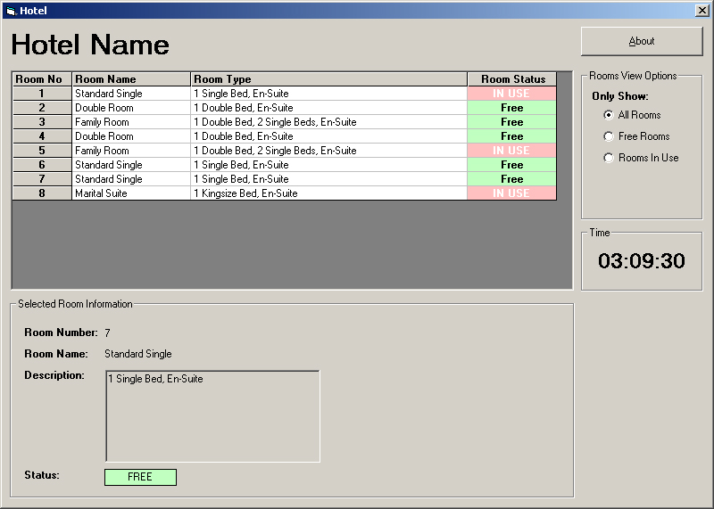



## Hotel \(Booking Reservation Example\)

### Description

A simple example of database use in VB.

Not very well written but may help some people.
 
### More Info
 

             |
---                |---
**Submitted On**   |2005-03-19 03:08:46
**By**             |[David Lowe](https://github.com/Planet-Source-Code/PSCIndex/blob/master/ByAuthor/david-lowe.md)
**Level**          |Beginner
**User Rating**    |4.5 (18 globes from 4 users)
**Compatibility**  |VB 6\.0
**Category**       |[Databases/ Data Access/ DAO/ ADO](https://github.com/Planet-Source-Code/PSCIndex/blob/master/ByCategory/databases-data-access-dao-ado__1-6.md)
**World**          |[Visual Basic](https://github.com/Planet-Source-Code/PSCIndex/blob/master/ByWorld/visual-basic.md)
**Archive File**   |[Hotel\_\(Boo1866313212005\.zip](https://github.com/Planet-Source-Code/david-lowe-hotel-booking-reservation-example__1-59564/archive/master.zip)

